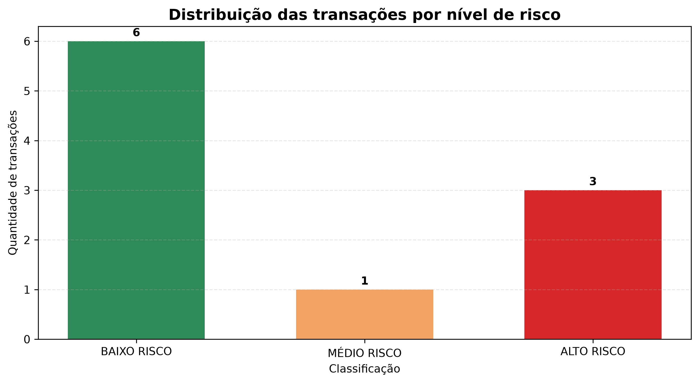

# BankSense

[](https://banksense-ingridrdev.streamlit.app)

Sistema desenvolvido em Python para simular a análise de risco de transações financeiras fictícias.

O BankSense utiliza regras predefinidas para analisar características de uma transação, calcular um score de risco de 0 a 100 e classificá-la como baixo, médio ou alto risco.

A versão atual utiliza **Supabase com PostgreSQL como fonte principal de dados**, mantendo um arquivo CSV como fallback para garantir o funcionamento do dashboard caso a conexão com o banco esteja indisponível.

## Aplicação publicada

Acesse o dashboard interativo:

**[Abrir o BankSense](https://banksense-ingridrdev.streamlit.app)**

## Objetivo

O projeto foi criado para praticar e demonstrar conhecimentos em:

* Python;
* análise e manipulação de dados;
* pandas;
* SQL;
* PostgreSQL;
* Supabase;
* integração entre aplicação e banco de dados;
* criação de dashboards;
* visualização de dados;
* lógica de programação;
* criação de regras de negócio;
* segurança com Row Level Security (RLS);
* variáveis de ambiente;
* Git e GitHub;
* publicação de aplicações.

## Funcionalidades

* Análise manual de uma transação pelo terminal;
* Leitura automática de uma base de transações em CSV;
* Cálculo individual do score de risco;
* Classificação das transações;
* Geração de indicadores analíticos;
* Exportação dos resultados para CSV;
* Gráfico com a distribuição dos níveis de risco;
* Dashboard interativo com Streamlit;
* Filtro por classificação de risco;
* Download dos resultados analisados;
* Armazenamento das transações em PostgreSQL utilizando Supabase;
* Consulta dos dados do Supabase pelo Python;
* Conversão dos dados do banco para DataFrame pandas;
* Uso do Supabase como fonte principal do dashboard;
* Fallback automático para CSV caso o banco esteja indisponível.

## Arquitetura atual

```text
Supabase / PostgreSQL
        |
        v
      Python
        |
        v
      pandas
        |
        v
    Streamlit
        |
        v
Dashboard publicado

        +
        
CSV como fallback
```

O dashboard tenta primeiro consultar a tabela `transacoes` no Supabase.

Caso a conexão não esteja disponível, o BankSense utiliza automaticamente o arquivo:

```text
data/transacoes_analisadas.csv
```

Dessa forma, o dashboard continua funcionando mesmo em caso de indisponibilidade temporária do banco.

## Banco de dados

Os dados são armazenados em uma tabela PostgreSQL chamada:

```text
transacoes
```

Principais colunas:

| Coluna             | Tipo          | Descrição                            |
| ------------------ | ------------- | ------------------------------------ |
| `id`               | `int8`        | Identificador único da transação     |
| `created_at`       | `timestamptz` | Data e hora de criação               |
| `valor`            | `numeric`     | Valor da transação                   |
| `hora`             | `int2`        | Hora em que a transação ocorreu      |
| `tipo`             | `text`        | Tipo da transação                    |
| `novo_dispositivo` | `bool`        | Indica uso de novo dispositivo       |
| `cidade_habitual`  | `bool`        | Indica se ocorreu na cidade habitual |
| `score_risco`      | `int2`        | Score calculado                      |
| `classificacao`    | `text`        | Nível de risco                       |

## Segurança

A tabela utiliza **Row Level Security (RLS)** do PostgreSQL.

Foi configurada uma política específica de leitura para permitir que o dashboard consulte os dados fictícios sem conceder permissões de alteração.

O projeto utiliza uma **Supabase Publishable Key**, enquanto chaves privilegiadas, como `service_role` ou Secret Keys, não são utilizadas pelo dashboard.

As configurações locais são armazenadas em um arquivo `.env`, que é ignorado pelo Git por meio do `.gitignore`.

O repositório possui apenas o arquivo:

```text
.env.example
```

que demonstra quais variáveis são necessárias sem expor credenciais.

No Streamlit Community Cloud, as mesmas variáveis são configuradas utilizando **Streamlit Secrets**.

## Variáveis de ambiente

Para executar a integração com Supabase localmente, crie um arquivo `.env` na raiz do projeto:

```env
SUPABASE_URL=https://seu-projeto.supabase.co
SUPABASE_PUBLISHABLE_KEY=sua_publishable_key
```

Nunca adicione ao repositório:

* Secret Keys;
* `service_role`;
* senhas do banco;
* tokens privados;
* arquivos `.env` contendo credenciais.

## Indicadores do dashboard

O painel apresenta:

* Quantidade de transações analisadas;
* Valor total das transações;
* Score médio da base;
* Quantidade e percentual de transações de alto risco;
* Distribuição das transações por nível de risco;
* Tabela detalhada com filtros.

## Regras utilizadas

| Condição                          | Pontuação |
| --------------------------------- | --------: |
| Valor acima de R$ 3.000           |       +40 |
| Transação realizada antes das 6h  |       +30 |
| Transação realizada via PIX       |       +10 |
| Utilização de um novo dispositivo |       +10 |
| Transação fora da cidade habitual |       +10 |

## Classificação do risco

| Score       | Classificação |
| ----------- | ------------- |
| De 0 a 29   | Baixo risco   |
| De 30 a 59  | Médio risco   |
| De 60 a 100 | Alto risco    |

## Estrutura do projeto

```text
BankSense/
├── data/
│   ├── transacoes.csv
│   └── transacoes_analisadas.csv
├── reports/
│   └── distribuicao_risco.png
├── src/
│   ├── analise_csv.py
│   ├── main.py
│   ├── supabase_client.py
│   └── visualizacao.py
├── .env.example
├── .gitignore
├── app.py
├── README.md
└── requirements.txt
```

## Tecnologias utilizadas

* Python 3;
* pandas;
* Matplotlib;
* Streamlit;
* PostgreSQL;
* Supabase;
* SQL;
* python-dotenv;
* Git;
* GitHub;
* Visual Studio Code;
* Streamlit Community Cloud.

## Como executar

### 1. Clone o repositório

```bash
git clone https://github.com/ingridrdev/BankSense.git
```

### 2. Entre na pasta do projeto

```bash
cd BankSense
```

### 3. Instale as dependências

```bash
python -m pip install -r requirements.txt
```

### 4. Configure as variáveis de ambiente

Crie um arquivo `.env` na raiz do projeto com:

```env
SUPABASE_URL=https://seu-projeto.supabase.co
SUPABASE_PUBLISHABLE_KEY=sua_publishable_key
```

Caso as configurações do Supabase não estejam disponíveis, o dashboard utilizará automaticamente o CSV como fallback.

### 5. Execute a análise manual

```bash
python src/main.py
```

### 6. Execute a análise automática do CSV

```bash
python src/analise_csv.py
```

### 7. Gere o gráfico de distribuição

```bash
python src/visualizacao.py
```

### 8. Execute o dashboard localmente

```bash
python -m streamlit run app.py
```

O painel será disponibilizado normalmente em:

```text
http://localhost:8501
```

## Arquivos de dados

O arquivo:

```text
data/transacoes.csv
```

contém as transações fictícias utilizadas como entrada.

Após a execução da análise automática, o BankSense gera:

```text
data/transacoes_analisadas.csv
```

contendo os dados originais e os resultados da análise.

Esse arquivo também funciona como fonte alternativa caso o Supabase esteja indisponível.

## Exemplo de resultado

```text
valor    hora  tipo            score_risco  classificacao
3500.0   2     pix             100          ALTO RISCO
4500.0   11    transferencia   50           MÉDIO RISCO
650.0    15    pix             10           BAIXO RISCO
```

## Visualização gerada



## Próximas melhorias

* Cadastro de novas transações diretamente pelo dashboard;
* Persistência automática de novas análises no PostgreSQL;
* Validação e tratamento de dados inválidos;
* Criação de testes automatizados;
* Ampliação dos indicadores e filtros;
* Consultas SQL mais avançadas;
* Upload de novas bases pelo dashboard;
* Criação de uma API com FastAPI;
* Ampliação da base fictícia para análises históricas;
* Experimentação com modelos de machine learning para classificação de risco.

## Aviso

Este projeto possui finalidade exclusivamente educacional.

Todos os dados utilizados são fictícios e as regras de risco foram criadas de forma simplificada para fins de estudo e desenvolvimento de portfólio.

O BankSense não representa um sistema antifraude real e não deve ser utilizado para decisões financeiras.
